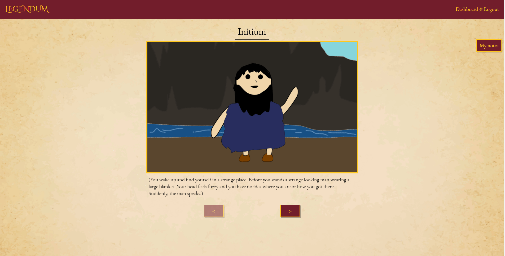
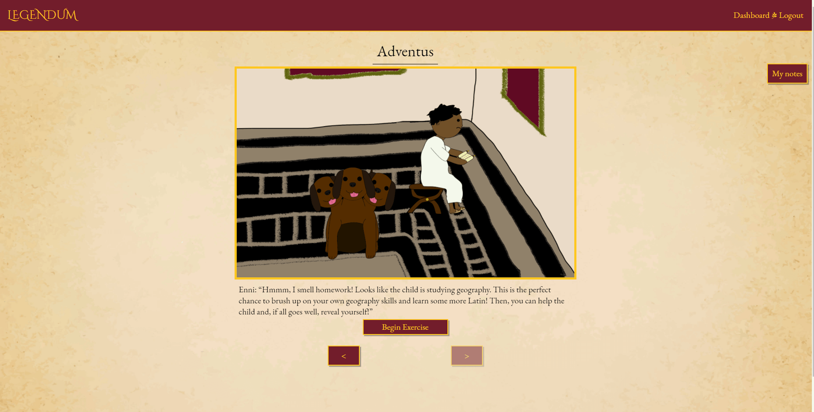
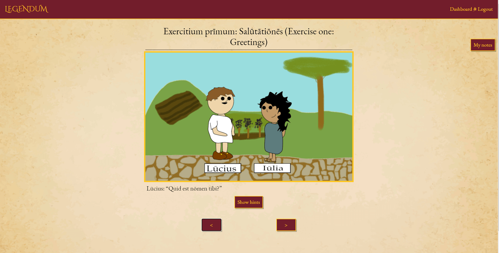
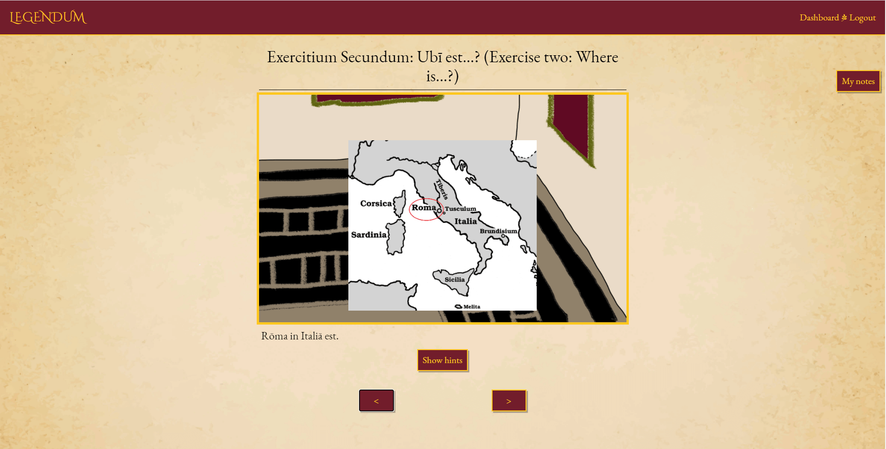
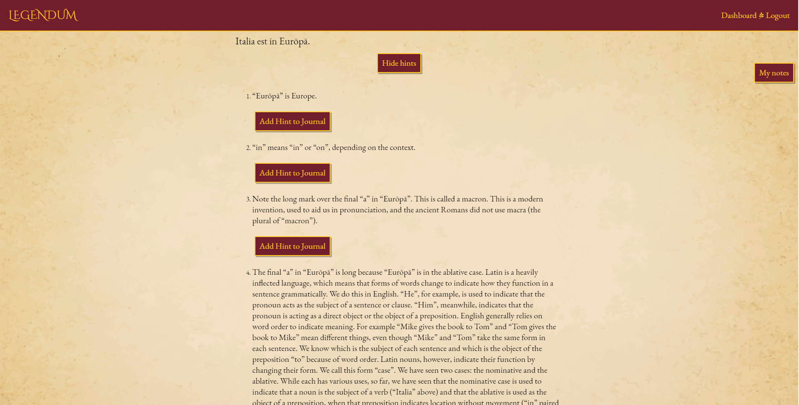
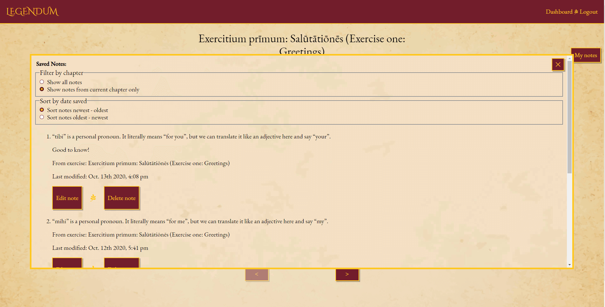
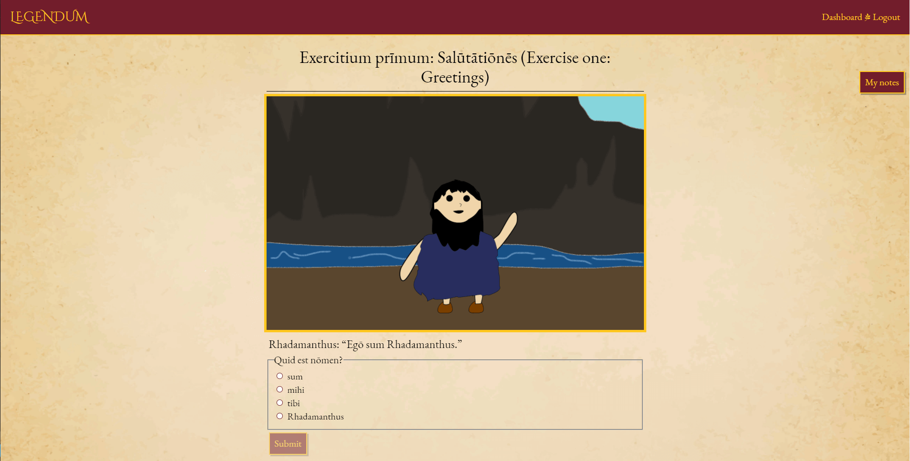
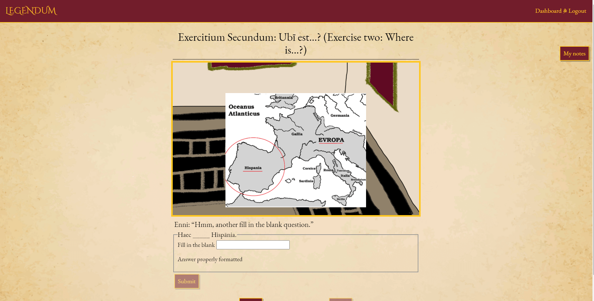
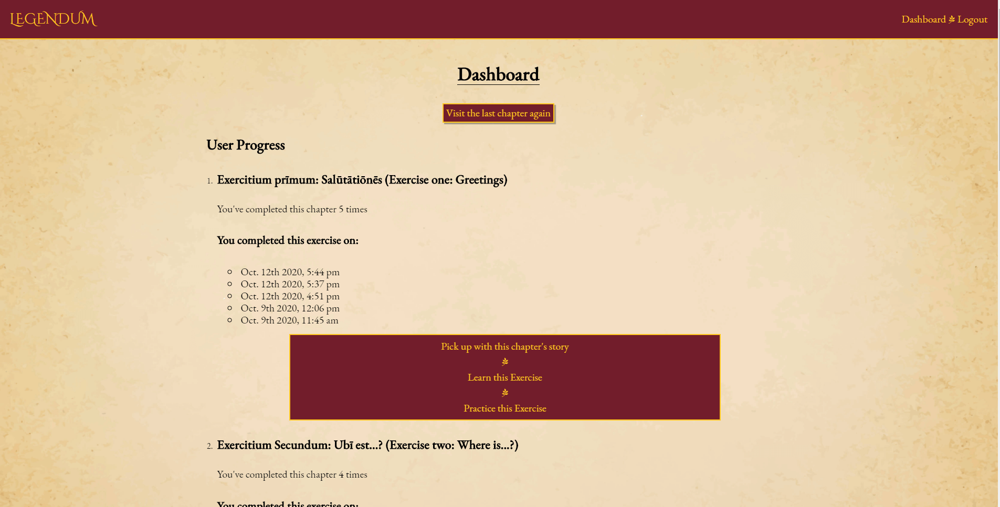
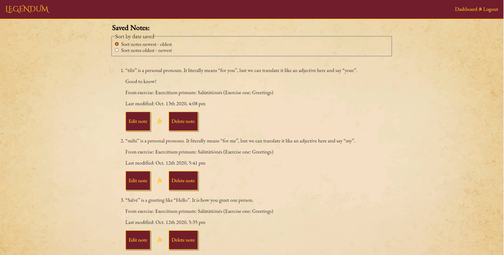

# Legendum

## Demo and API
[Live Demo](https://legendum.herokuapp.com/)

[API](https://github.com/lkarper/legendum-server)

## Summary
Legendum is a Latin learning app that uses stories, images, and short quizzes to teach Latin!  Registered users can track their progress through the story's chapters and save grammatical notes that they can reference later.  You don't need to register to learn, but you'll need an account to save your own notes and your progress.  This demo version of Legendum contains two chapters.  The goal is to release new chapters regularly in the future.

## How does Legendum Work?
Legendum was designed with two goals in mind: keep the learner engaged and build the learner's confidence.

### Engagement Through Stories and Images
Legendum is designed like a game and users learn Latin by completing chapters in a story.  The story is full of fun characters, charming images, and the occasional bit of witty banter.  Each chapter begins with a scene in English designed to engage users in the learning process.

You can get started with [Chapter 1](https://legendum.herokuapp.com/game/story/1)!

Scenes from English introductions:

### Build your Confidence with Comprehensible Input
After the user reads through the introduction, the chapter's Latin lesson begins. Lessons are designed on the principles of Comprehensible Input. In short, proponents of this theory of language learning argue that the best way to learn a language is to be exposed to it without the filter of another language.

Legendum uses short sentences, repetition, and images to help students understand the Latin that they are reading without having to translate it in their heads!  There are, however, hints, explanations, and tips throughout the lesson that a user can toggle on and off. This means that users can avoid the stress of "not knowing" what's going on. Stress is a major impediment to language learning, so Legendum aims to make learning Latin as stress-free as possible!  Registered users can save the grammatical tidbits that are presented and can even add personal notes.

Too exicted about Latin to start with an English scene?  Jump right in and start learning with [Exercise One](https://legendum.herokuapp.com/game/exercises/1/learn)!

How Legendum teaches:

### Test yourself with Short Quizzes
Each lesson is followed by a short quiz that helps users gauge their comprehension and retention.  These quizzes are low-stress undertakings.  If an incorrect answer is given, the user is presented with a short hint or explanation on why the answer is incorrect.  Users can simply try again if they get the question wrong and overall "grades" are not kept.  Registered users have access to their notes throughout.

Already know some Latin and want to test yourself out right away?  [Try the first quiz!](https://legendum.herokuapp.com/game/exercises/1/do)

Legendum quiz questions:

## Get Started
Get started by [registering](https://legendum.herokuapp.com/register) for an account!
Registered users can track their progress through lessons and stories, see how many times they've completed each chapter, and access and edit their notes on the [dashboard](https://legendum.herokuapp.com/dashboard).

The Legendum dashbaord:

Don't want to register just yet? Jump right into [Chapter 1](https://legendum.herokuapp.com/game/story/1)!

## Created With
* React
* React Router
* Node.js
* HTML
* CSS
* JavaScript

## Tested With
* Jest
* Enzyme
